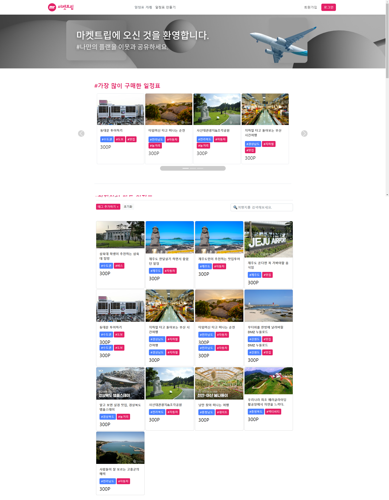
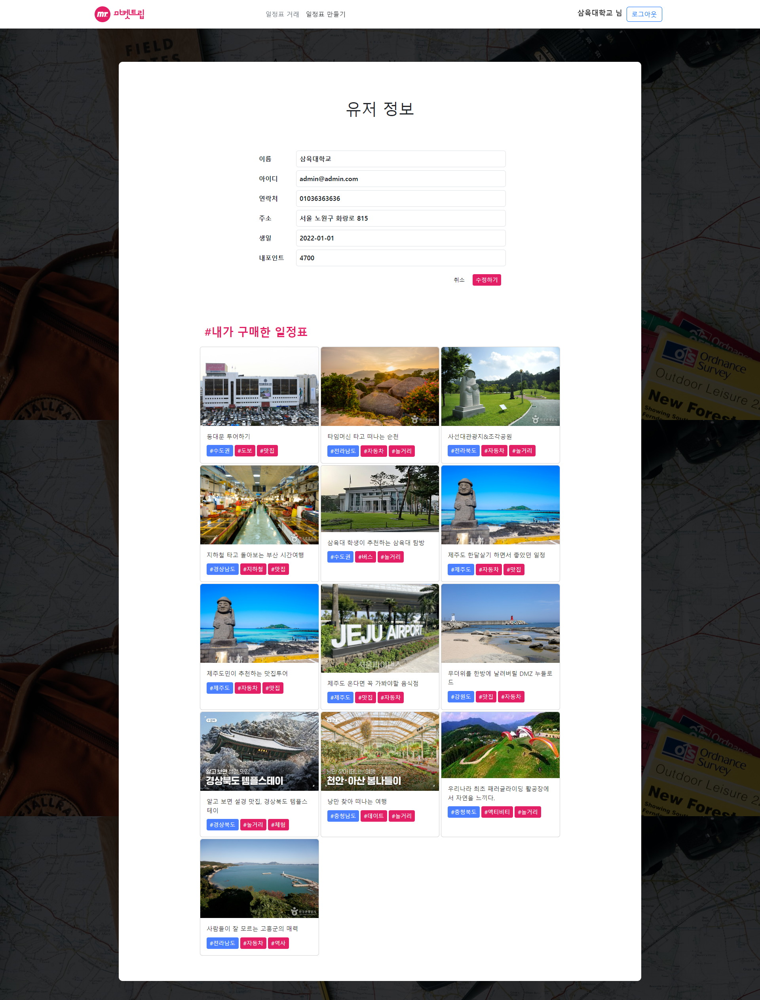
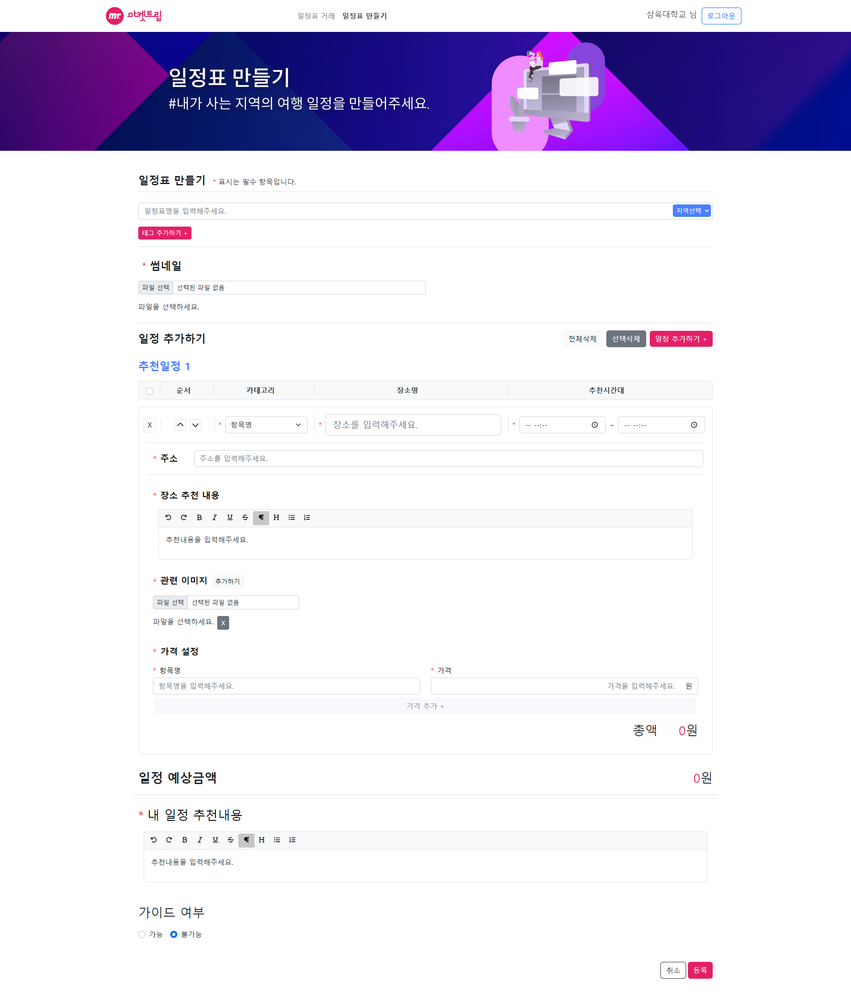
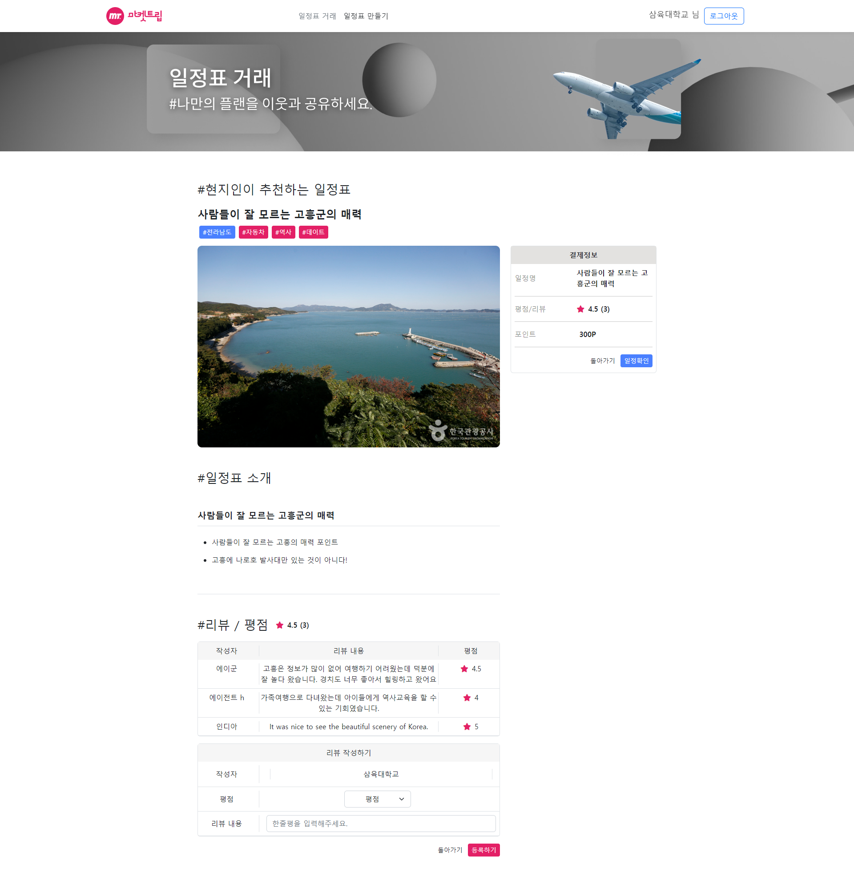
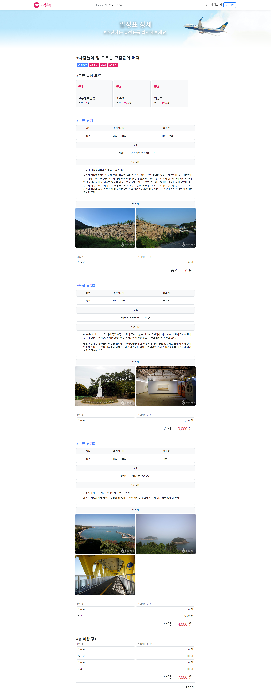
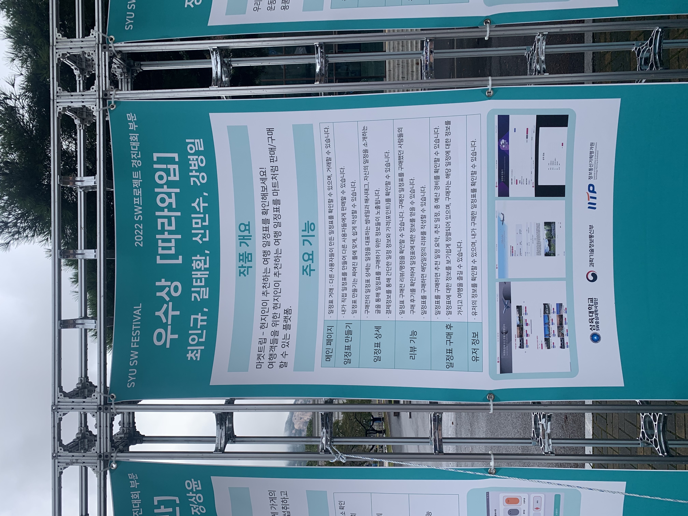
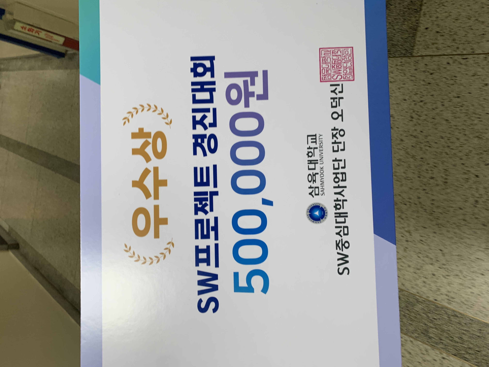

# 2022 SW프로젝트 경진대회_따라와입

## 프로젝트 정보
| 프로젝트 명                  | 프로젝트 내용                                                                                                                                                                                                                                                                                                                                              |
|-------------------------|------------------------------------------------------------------------------------------------------------------------------------------------------------------------------------------------------------------------------------------------------------------------------------------------------------------------------------------------------|
| 마켓트립 :  현지인이 추천하는 여행 일정표 | - 여행객들을 위한 현지인이 추천하는 여행 일정표를 마트처럼 판매/구매할 수 있는 플랫폼입니다.  - 여행을 했던 곳, 자신의 지역에 자신만 알고 있는 명소, 맛집, 놀거리 등을 짜여진 틀에 따라 작성하며, 여행 일정표를 만들어 판매할 수 있습니다. 여행 일정표를 만들기 귀찮은 여행객은 플랫폼을 통해 일정표를 구매하고 참고하여 여행을 즐길 수 있습니다.  - MBTI 중 J(계획형 - 공급자)가 계획한 여행 계획표를 P(무계획형 - 수요자)가 구매하여 여행을 즐길 수 있습니다. - 여행장소로 유명하지는 않지만, 정말 좋은 장소들을 추천하여 지역경제 활성화에 도움을 줄 수 있습니다. |

## 사용기술 및 담당업무
- 사용기술 : Vue.js : HTML, CSS, JavaScript, BootStrap, axios
- 담당업무 : 팀장, 프론트엔드 개발, Vue.js를 활용한 기능 개발, 웹 제작, 화면설계서 작성, 문서화

## 프로젝트 개요
### 가. 추진배경 및 필요성
- 침체 된 골목상권 활성화 : 유명한 관광지가 아니어서 활성화가 되지못한 장소들에 여행객을 유치시켜 활성화 하여 지역경제를 활성화 시키는 목적을 가지고 있습니다. 코로나로 인한 제한들이 풀리면서 수많은 사람들이 여행을 즐기고 싶어 합니다. 하지만 사람들이 많은 여행지, 유명한 관광지 등이 아닌 색다른 여행을 즐기고 싶어하는 사람들에게 추천할만한 여행 일정 정보를 얻을 수 있게 하여, 자신의 지역의 상권을 활성화시키고자 합니다.
- 현지인만 알고 있는 골목 상권 : JTBC에서 방영한 ‘효리네 민박’의 경제효과는 알려지지는 않고, 현지인만 아는 여행지에 대하여 관광객, 가치유발을 증가시켰습니다. 그리하여, 현지인이 추천하는 현지의 숨은명소, 맛집, 놀거리 등을 일정표로 만들어 여행객들에게 제공하여 알려지지 않은 장소의 가치를 높이기 위함에 기획하였습니다.
- 슬로건 : “일정은 내가 만들게, 너는 따라오기만 해!”라는 슬로건을 가지고 여행에 대한 일정표를 만들어 판매하고, 원하는 여행의 일정을 구매하여 공급자, 수요자가 서로 윈윈할 수 있는 플랫폼을 만들어 여행객들에게 알맞은 여행 정보(일정표)를 제공해야겠다는 필요성을 가졌습니다.
- 마켓트립 : 여행에 대한 일정표를 얻을 수 있는 플랫폼으로 현지인 혹은 내가 가봤던 여행지에 대한 정보를 ‘일정표 만들기’를 통하여 짜여진 틀에 맞게 일정 정보를 생성할 수 있습니다. 생성한 일정표는 판매되어 자신이 원하는 여행을 즐기고 싶어하는 사용자에게 판매하여 수익을 창출할 수 있습니다. 사용자는 여행 일정표를 부담되지 않는 가격에 구매하여 여행지에 대한 정보 검색의 수고를 ‘마켓트립’을 통하여 덜어질 수 있습니다.

### 나. 프로젝트 주요기능
|    페이지 명     | 상세 내용                                                                                                                       |
|:------------:|:----------------------------------------------------------------------------------------------------------------------------|
|  **메인 페이지**  | ・일정표 거래 : 다른 사용자들이 만든 일정표를 확인할 수 있으며, 거래할 수 있습니다.                                                                           |
| **일정표 만들기**  | ・내가 직접 일정표를 만들어 다른 사용자들에게 판매할 수 있습니다. ・일정표 만들기는 짜여진 틀에 맞게, 쉽게 작성할 수 있습니다.                                               |
|  **일정표 상세**  | ・구매전의 일정표 상세는 일정을 대표하는 썸네일과 해시태그, 자신의 일정을 소개하는 글을 통해 일정표를 구매하기 위한 정보들이 노출됩니다. ・결제정보를 통해 간단한 일정 정보와 가격(포인트)를 확인할 수 있습니다. |
|  **리뷰 기능**   | ・일정표 구매전 리뷰/평점을 확인할 수 있습니다. 구매전 일정표를 구매했던 사람들의 구매 후기를 확인하여 일정표에 대한 정보를 얻을 수 있습니다. ・일정표를 구매하면 해당일정의 리뷰를 작성할 수 있습니다.      |
| **일정표 구매 후** | ・일정표를 구매하면 추천 일정 요약, 추천 일정, 총 예산 경비를 확인할 수 있습니다. ・일정표에 대한 정보를 보기쉽게 정렬되어 있으며, 구매자는 해당 일정에 대한 정보를 가지고 여행을 즐길 수 있습니다.           |
|  **유저 정보**   |・유저의 정보를 확인할 수 있으며, 내가 구매한 일정표를 확인할 수 있습니다. |

### 다. 결과물 상세 이미지
- [ 메인 ]  
  
- [ 유저정보 ]   
  
- [ 일정표 만들기 ]  
  
- [ 일정표 구매 전 ]  
  
- [ 일정표 구매 후 ]  

### 라. 문제점 및 해결방안
- 프로젝트 관리 측면
  - 학교 일정과 병행하며 프로젝트를 진행하여 진행이 유연하지 못함   >> 주 2회 이상 회의 및 개별 시간에 개발을 진행하며 해결
- 작품 개발 측면
  - 짧은 기간안에 기능의 개발 및 빌드, 배포에 대한 불확실성   >> 개개인의 노력으로 인하여 기간안에 빌드 및 배포 성공

## 프로젝트 기대효과 및 활용분야
- ‘마켓트립’의 사용자들에게 색다른 일정표 정보를 바탕으로 마케팅 기회 확보 및 일정표 거래 플랫폼을 운영할 수 있습니다.
- 여행객들에게 알맞은 여행 정보를 제공하여 여행 일정 정보를 쉽게 얻을 수 있습니다.
- 알려지지 않고, 현지인만 알고 있는 숨은 장소들을 활성화시켜 지역경제의 가치를 높일 수 있습니다. 

## 추후 계획
### 확장 계획
- ‘마켓트립’의 백엔드는 RestAPI 서버로 구현되어 웹 뿐만아니라 추후 앱서비스까지 출시 가능 합니다.
- 일정표를 만드는 현지인 가이드 기능을 추가하여 채팅을 통해 매칭되며 일정표와 관련된 가이드를 제공할 수 있게 할 것입니다.
- 일정표에 해당하는 정보에 대한 예약서비스를 활성화시켜 숙소, 음식점 등 장소의 알맞은 서비스를 제공할 수 있습니다.
- 자신이 만든 일정표를 사용자가 구매 시 그에 상응하는 보상을 제공합니다.
### 수익 창출
- 광고 수수료 : ‘마켓트립’ 양쪽 공간에 광고 추가
- 포인트 충전 : 일정표 구매를 위한 포인트 충전
- 중개 수수료 : 일정 정보의 서비스 활성화

## 공모전 결과
### SW프로젝트 경진대회 우수상 수상, SW페스티벌 시연

